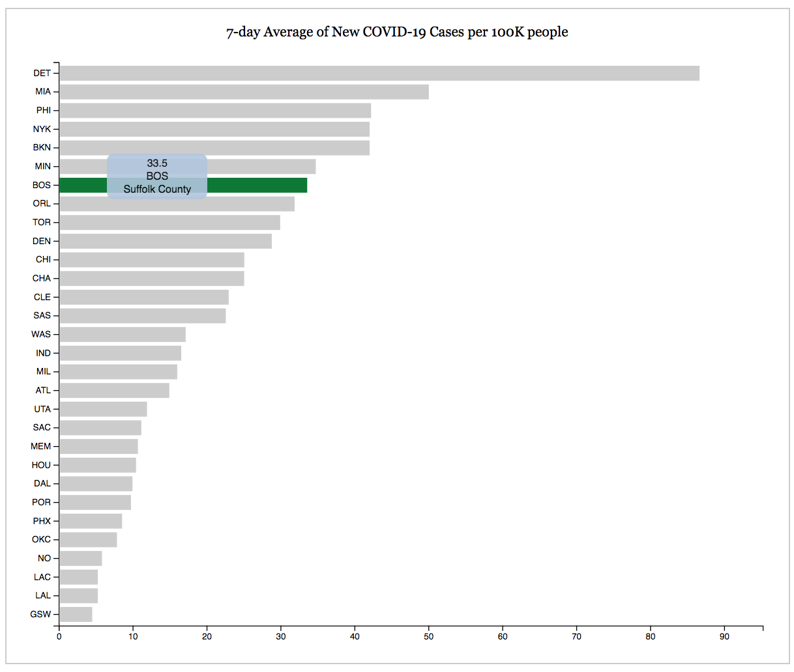
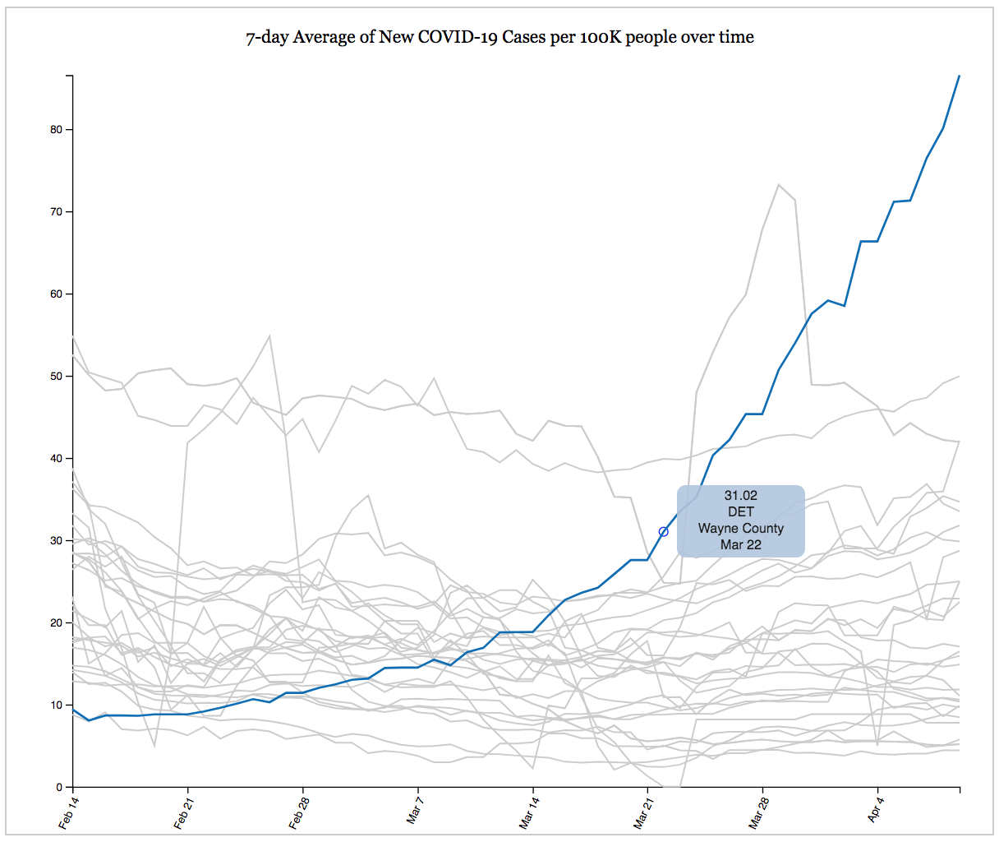

## [NBA-County-Covid-Data](http://www.elismukler.com/NBA-County-Covid-Data/)
Tracking Covid-19 Cases in Counties with NBA Arenas using [D3.js](https://d3js.org/)

Data Courtesy of [The New York Times](https://github.com/nytimes/covid-19-data) auto-updated daily.

To run locally:
- Enter into the terminal: `python -m http.server`
- Navigate to localhost:8000 in your browser.
