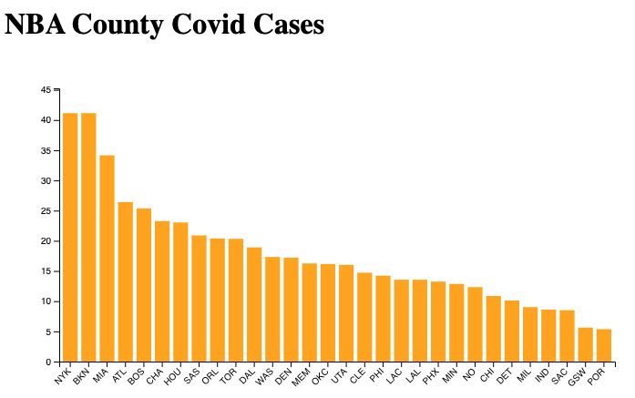

# NBA-County-Covid-Data
Tracking Covid-19 Cases in Counties with NBA Arenas

To run:
- Enter into the terminal: `python -m http.server`
- Navigate to localhost:8000 in your browser.

To Dos:
- Show line graphs for each county over time
- Update data on pageload?
- Store old data while adding new data on update
